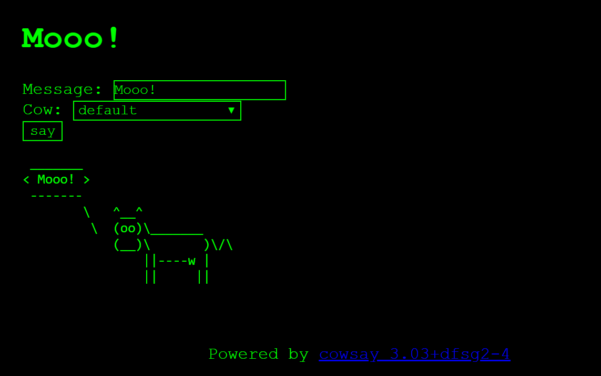
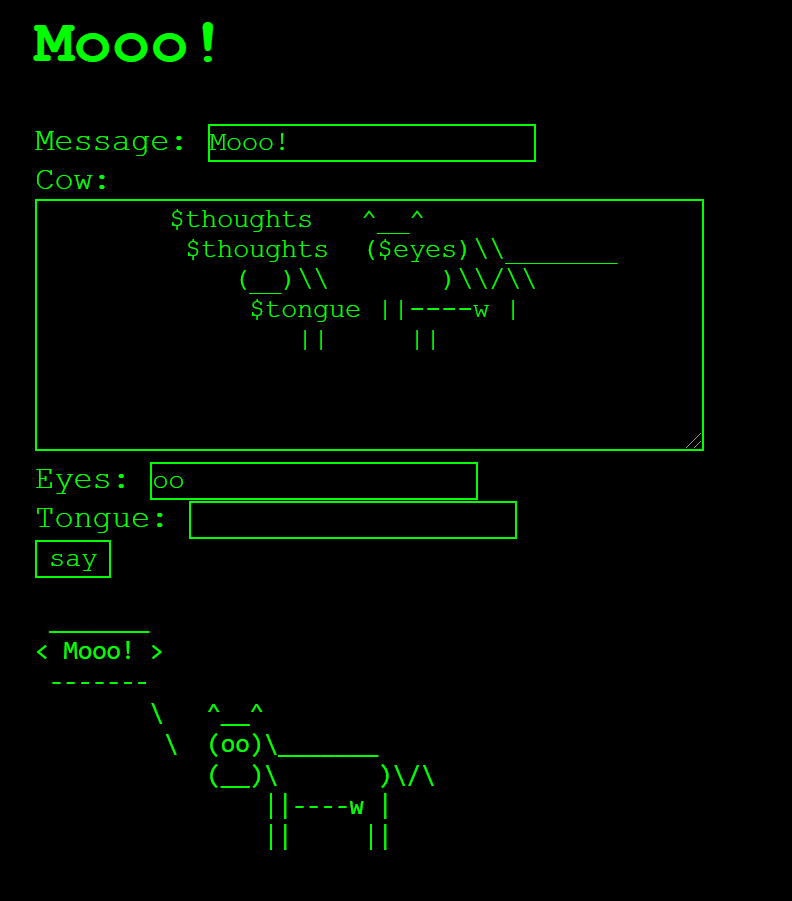
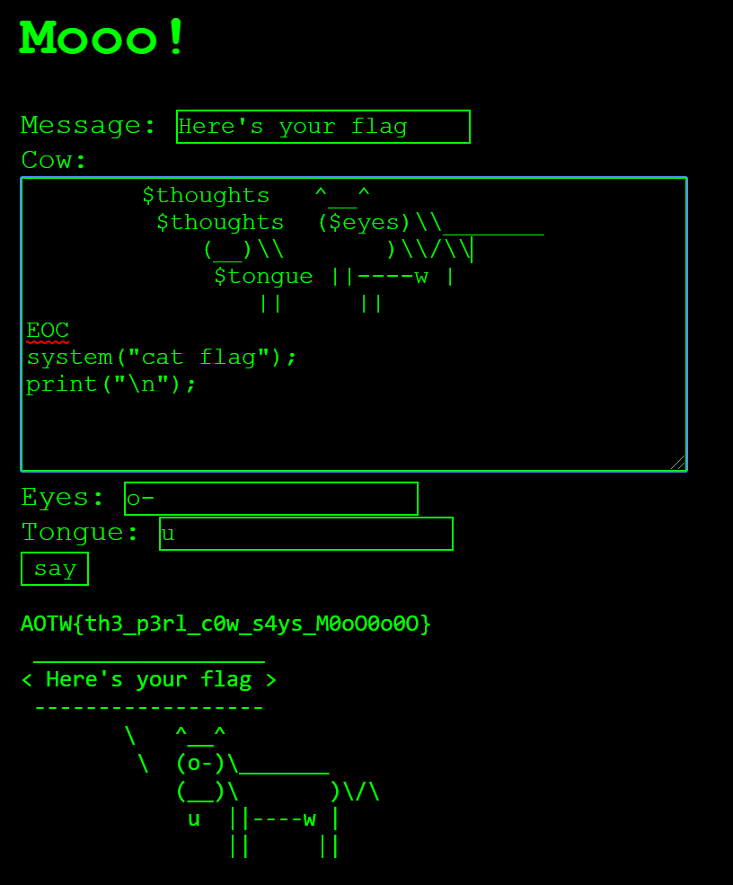

# mooo

## Solution 
A web service that allows the usage of [cowsay](https://packages.ubuntu.com/bionic/cowsay).



The second option in the "Cow" dropdown list is "custom" and will take you to `/cow_designer`



Looking at one of the default `.cow` files reveals the following format:

```Perl
$the_cow = <<"EOC";
        $thoughts   ^__^
         $thoughts  ($eyes)\\_______
            (__)\\       )\\/\\
             $tongue ||----w |
                ||     ||
EOC

```

Cowsay uses Perl and when you use a custom cow file the Perl code in that file gets executed before the cow is printed.
Due to several characters being blacklisted (`@, {, }, [ and ]` and `$ except when using $thoughts, $eyes or $tongue`) we need to first end the `$the_cow` string with `EOC` before we can inject Perl code.

To print the flag we can use:

```Perl
EOC
system("cat flag");
```
 as payload.

 